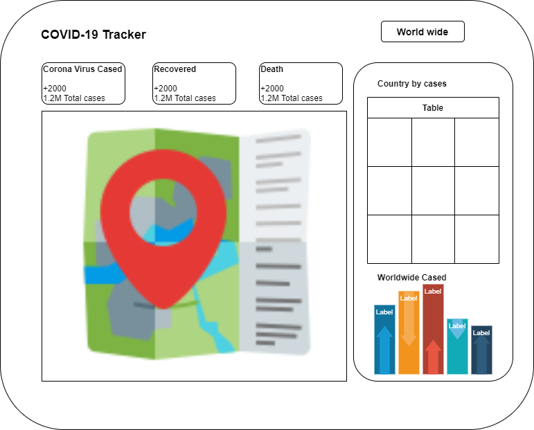

# COVID-19-Tracker

## Plan for the app
1. Create wireframe
   
   

2. Create React App
3. Cleanup project
4. Structure of COVID-19 Tracker
5. Create Header
6. Create info box
7. Create table
8. Create chart
9. Create map
10. Styling app
11. Deploy the app using Digital Ocean app platform
   